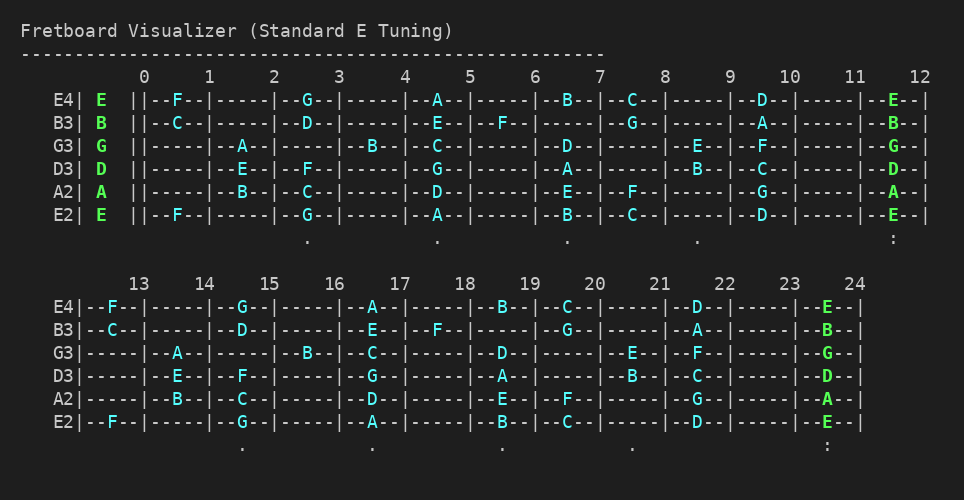
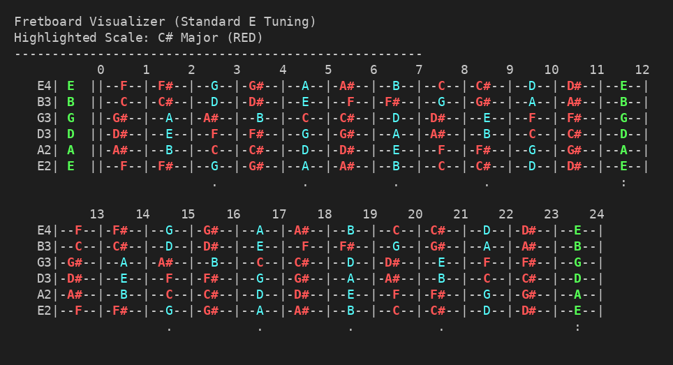

# Fretboard Visualizer

A lightweight C++ CLI tool for guitarists to visualize the fretboard, explore scales, and identify note positions in Standard E tuning.

## Features

- **Terminal-based Fretboard**: Displays a 24-fret guitar neck directly in your console.
- **Scale Highlighting**: Highlight notes of any Major or Minor scale in **Bold Red**.
- **Accidental Support**: Toggle display of sharps/flats.
- **Color Coded**:
  - 🟢 **Green**: Open string notes.
  - 🔵 **Cyan**: Natural notes.
  - 🟡 **Yellow**: Accidentals (when enabled).
  - 🔴 **Red**: Scale highlights.
- **Standard Markers**: Includes fret markers (dots at 3, 5, 7, 9, 15, 17, 19, 21 and double dots at 12, 24).

## Preview

### Default View (Naturals Only)


### Scale Highlighting (C# Major)


## Getting Started

### Prerequisites

- A C++ compiler (e.g., `g++`)
- `make` build utility

### Installation

1. Clone the repository (or download the source files).
2. Build the project using the provided `Makefile`:

```bash
make
```

This will generate the `fretboard` executable.

## Usage

Run the program from your terminal:

```bash
./fretboard [options] [scale]
```

### Options

- `-h, --help`: Show the help message.
- `-s, --sharps`: Show all accidentals (sharps/flats) by default.

### Scale Format

Highlight a scale by passing its name in the format `[Root][Type]`.
- **Root**: C, C#, Db, D, D#, Eb, E, F, F#, Gb, G, G#, Ab, A, A#, Bb, B
- **Type**:
  - Major: `Maj`, `Major` (default if omitted)
  - Minor: `m`, `min`, `minor`

### Examples

**View the standard fretboard (naturals only):**
```bash
./fretboard
```

**Highlight the C# Major scale:**
```bash
./fretboard C#Maj
```

**View all accidentals and highlight A Minor:**
```bash
./fretboard --sharps Am
```

## How it Works

The tool calculates note frequencies and positions mathematically starting from a reference pitch (A4 = 440Hz). It handles enharmonic equivalents (like C# and Db) and maps them to the correct fretboard positions for standard tuning.

## License

This project is open-source and available under the [MIT License](LICENSE).
